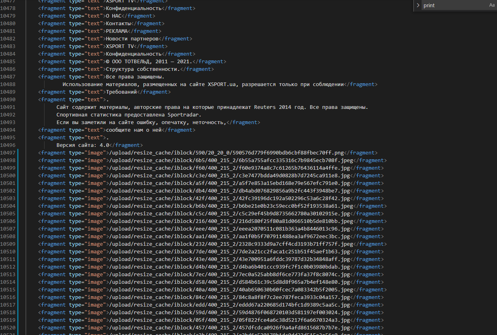

# Лабораторна робота 1
## Вивчення базових операцій обробки XML-документів 

### Завдання 1.
На основі базової адреси Web-сайту виконати обхід наявних сторінок сайту, відокремлюючи текстову та графічну інформацію від тегів HTML.  Пошук вузлів виконувати засобами XPath. Наступну сторінку для аналізу цього ж сайту обрати як одне із гіперпосилань на даній сторінці (тег <a href=”url”/>). Обмежитись аналізом 20 сторінок сайту. Зберегти XML у вигляді файлу. Формат XML-документу:

### Завдання 2.
Виконати аналіз отриманих даних засобами XML згідно варіанту та вивести результати у консольне вікно. Відбір вузлів та розрахунки за варіантом виконувати засобами XPath.

### Завдання 3.
Проаналізувати вміст Web-сторінок інтернет-магазину (див. варіант). Отримати ціну, опис та зображення для 20 товарів з нього за допомогою DOM-парсеру та мови XPath для пошуку відповідних вузлів. Результат записати в XML-файл.

### Завдання 4.
Перетворити отриманий XML-файл у XHTML-сторінку за допомогою мови XSLT. Дані подати у вигляді XHTML-таблиці та записати його у файл.
