# Лабораторна робота 2. Практика використання серверу Redis

# Залізний Захар Юрійович КП-82

## Завдання

[Завдання](http://scs.kpi.ua/sites/default/files/lab2_bd2-db2019_2020.pdf)

## Загальні відомості про виконання лабораторної роботи

Користувачі були представлені за допомогою HASH (Ключ - Значення). Ключем являється унікальний ідентифікатор користувача, а його значенням - ім'я користувача та лічильники, які дають змогу моніторити статистику повідомлень, выдповыдно до статусу :

- Створено
- У черзі
- Перевіряється на спам
- Заблоковано через спам
- Відправлено адресату
- Доставлено адресату

Повідомлення - використовують аналогічну до користувачів структуру запису - HASH. Id - унікальний ідентифікатор повідомлення, текст - значення

Для відображення користувачу вхідних повідомлень (які надійшли саме йому) було обрано LIST, адже він дозволяє зберігати хронологічний порядок появи нових повідомлень.

Для відображення списку користувачів, відповідно до їх активності використано сортований сет (ZET). Сортування виконано по к-сті відправлених повідомлень (Senders list), к-сті спаму (Spammers list)

Для моніторингу повідомлень використано PUB/SUB. За допомогою підписання на конкретний канал можна відслідковувати активність користувачів та повідомлення, що додані до спаму ( Рандомізація )

Черга повідомлень представлена структурою LIST, що дає змогу відслідковувати хронологічний порядок повідомлень

Приклади роботи програми:

## Інтерфейс користувача ( користувач не ввійшов до системи )

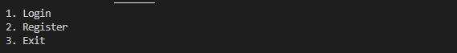

## Вхід до системи ( за іменем ). Реєстрація проходить аналогічно

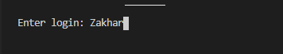

## Інтерфейс користувача

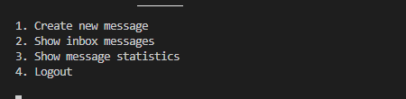

## Відправлення повідомлення

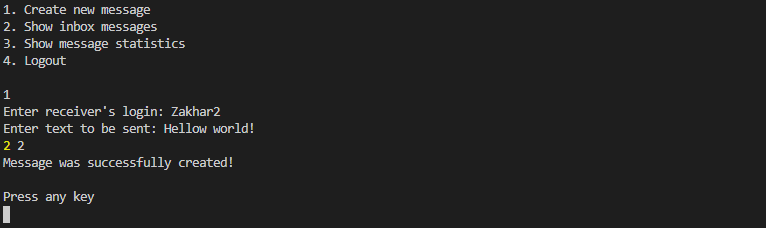

## Перегляд повідомлення

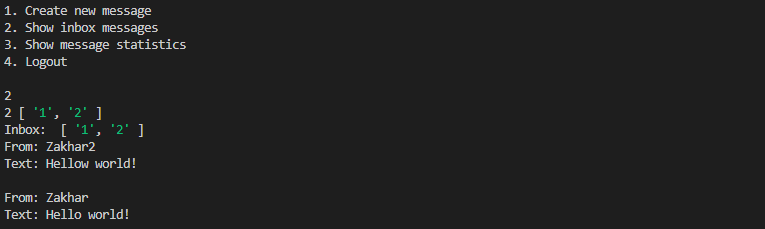

## Перегляд статусів повідомлень користувача

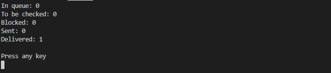

## Моніторинг активності користувачів (PUB/SUB)

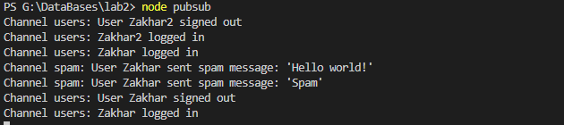

## Інтерфейс адміністратора

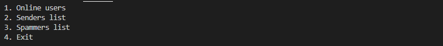

## Список онлайн користувачів

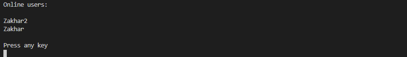

## Статистика активності користувачів ( відправлені повідомлення )

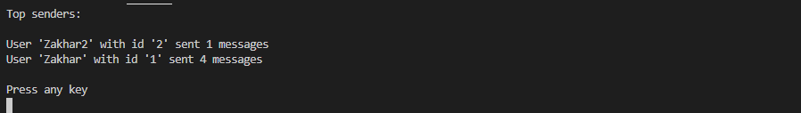

## Статистика активності користувачів ( спам повідомлення )

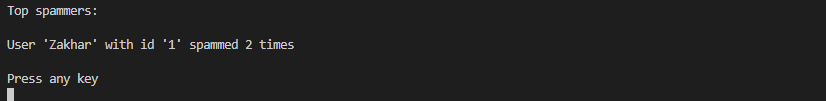
